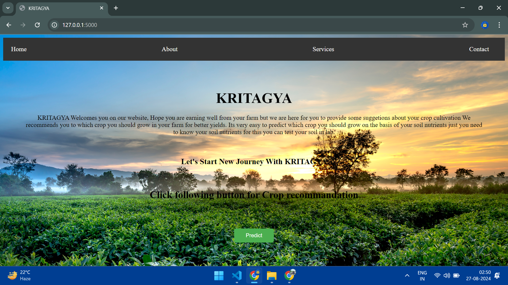
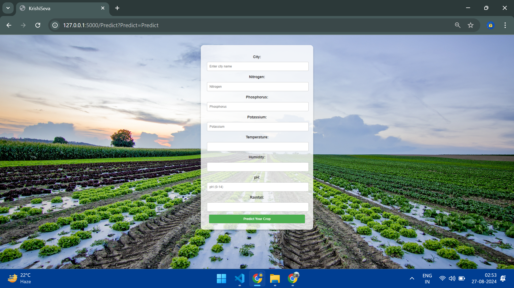
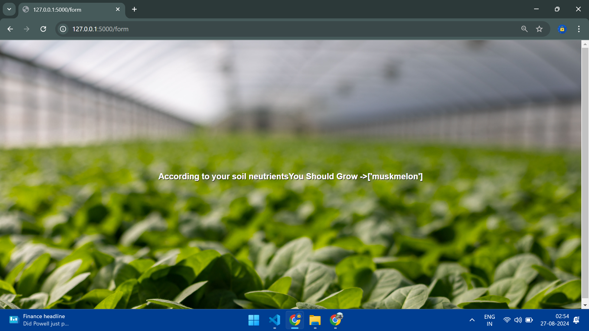

# **Crop Recommendation System**

### *Empowering Farmers with Data-Driven Crop Choices*

---

## **Introduction**

Agriculture, the backbone of our civilization, is evolving with the advent of modern technology. The **Crop Recommendation System** is a cutting-edge tool designed to help farmers make informed decisions about crop selection by analyzing key factors such as soil mineral composition (potassium, nitrogen, and phosphorous), humidity, temperature, and rainfall. This data-driven approach allows for more precise crop recommendations, leading to increased productivity, sustainability, and resilience in farming practices.

In this repository, we explore how this system works and how it leverages environmental and soil data to provide the best crop suggestions for various regions.

## **How It Works**

Our Crop Recommendation System takes the following parameters into account:

- **Soil Minerals**: Potassium, Nitrogen, and Phosphorus content in the soil are analyzed.
- **Environmental Factors**: Temperature, Humidity, and Rainfall data are considered.
- **Weather Data Integration**: Real-time weather data is fetched using the OpenWeatherMap API to provide localized recommendations.

By integrating these factors, the system suggests the most suitable crops for the given soil and weather conditions, optimizing both yield and sustainability.

---

## **Key Features**

- **Soil Mineral Analysis**: Determines the content of essential nutrients like potassium, nitrogen, and phosphorus.
- **Environmental Monitoring**: Considers local temperature, humidity, and rainfall data in the decision-making process.
- **Weather Data Integration**: Fetches real-time weather data using OpenWeatherMap API for accurate recommendations.
- **User-Friendly Interface**: Easy-to-use web interface built with Flask and HTML for seamless interaction with the system.
- **IoT Device Development**: In addition to weather APIs, we are developing IoT devices to measure parameters that are not available through APIs, such as soil moisture, temperature at the root zone, and light intensity.

---

## **Technologies Used**

- **Languages**: Python, HTML, CSS
- **Framework**: Flask
- **Machine Learning**: Scikit-learn, Joblib (for model storage)
- **API**: OpenWeatherMap API for weather data
- **IoT**: Development of IoT devices for additional environmental data collection

---

## **Getting Started**

### **Prerequisites**

1. **Python 3.7+**
2. Install the required packages:
   ```bash
   pip install -r requirements.txt
   ```
3. Sign up for an OpenWeatherMap API key: [OpenWeatherMap](https://openweathermap.org/)

### **Clone the Repository**

```bash
git clone https://github.com/anshuman018/crop-recommendation-system.git
cd crop-recommendation-system
```

### **Run the Application**

1. **Model Loading**: Ensure the trained machine learning model is available as `crop_app` (saved using Joblib).
2. **Start the Flask App**:
   ```bash
   python app.py
   ```

3. Visit `http://127.0.0.1:5000/` in your browser.

---

## **Screenshots**

| Home Page | Prediction Page | Crop Recommendation Result |
| --- | --- | --- |
|  |  |  |

---

## **Future Enhancements**

- **IoT Device Integration**: We are working on integrating IoT devices for collecting real-time soil moisture, root zone temperature, and light intensity data, which will further enhance the accuracy of our crop recommendations.
- **Improved UI/UX**: Enhancing the user experience with more interactive features and dynamic content.
- **Advanced AI Algorithms**: Expanding our machine learning models to include more advanced algorithms for even more precise recommendations.

---

## **Contributing**

We welcome contributions from the community. Whether you want to improve the machine learning model, enhance the interface, or add new features, feel free to fork the repository and create a pull request.

---

## **License**

This project is licensed under the MIT License - see the [LICENSE](LICENSE) file for details.

---

## **Contact Information**

**Developer**: Anshuman Singh  
**GitHub**: [Anshuman018](https://github.com/anshuman018)  
**LinkedIn**: [Anshuman Singh](https://www.linkedin.com/in/anshuman-singh/)

For inquiries or feedback, feel free to reach out at anshuman.singh.cs22@gmail.com.

---

## **Acknowledgements**

Special thanks to:
- **OpenWeatherMap** for their reliable weather API.
- **Flask** for powering the web application.
- **The agriculture community** for inspiring this project to create a sustainable and data-driven future.
